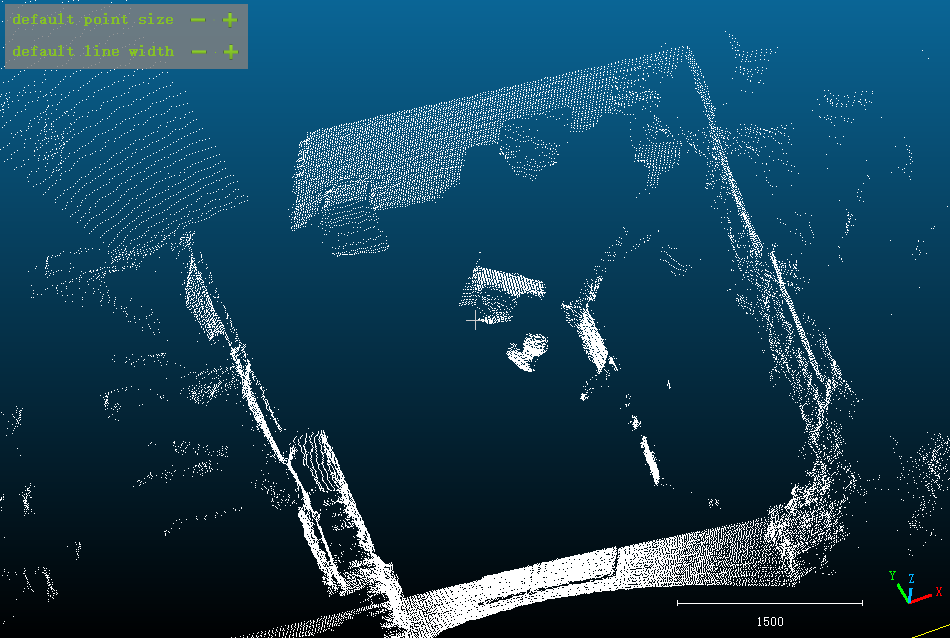

# Ouster 激光雷达原生API编程入门

> 原作者：**张佳炜**
>
> **深圳市沣满智能科技有限公司**
>
> [样例参考](https://deepwiki.com/ytldsimage/OSLidarAPI-DEMO) 及  [PDF文档](https://github.com/ytldsimage/OSLidarAPI-DEMO/blob/7ea6cab7/ouster_api/ouster_api.pdf) 下载

Ouster 激光雷达为软件访问和控制传感器提供了一些API,并在此基础上通过 Ouster SDK进行了封装, 以便开发者更方便地使用;尽管如此,Ouster 在其产品手册或帮助文档中公开了这些API的说明和使用方法,本文介绍如何在不依赖 Ouster SDK的情况下,直接使用底层API访问和控制雷达,供研究学习或希望绕过 SDK 直接使用底层API的用户参考。

本文的内容适用于 Ouster OS0、OS1和OS2 硬件版本号 Rev06/Rev07,固件版本号v2.5.3/v3.0.x/v3.1.x 的激光雷达,API操作的代码使用C编写,测试使用的传感器型号为OS-1-64 Rev 06,固件版本号为v2.5.3。

## 1. HTTP API

### 1.1. 简介

Ouster 激光雷达启动后运行了一个HTTP Server,连接至雷达的主机可以发起HTTP请求,获取雷达状态或对雷达进行配置,基本的HTTP请求方式包括GET、POST、PUT 和DELETE,具体的API列表,参考固件用户手册。

### 1.2. API 验证

实验使用的激光雷达型号为OS-1-64,固件版本号为v2.5.3,域名为“ouster”。以下使用curl 命令行工具向雷达发起HTTP请求:

**1. GET**

获取 `sensor_info`:

```bash
curl http://ouster/api/v1/sensor/metadata/sensor_info | jq
```

返回结果:

```json
{
  "prod_pn": "840-103575-06",
  "build_date": "2024-01-11T06:02:47Z",
  "status": "STANDBY",
  "prod_sn": "122220003521",
  "prod_line": "0S-1-64-BH",
  "build_rev": "v2.5.3",
  "image_rev": "ousteros-image-prod-aries-v2.5.3+20240111055903",
  "initialization_id": 7109744
}
```

**2. POST**

POST方法可用于配置雷达:

```bash
curl -X POST http://ouster/api/v1/sensor/config -H 'Content-Type: application/json' --data-raw '{"lidar_mode": "1024x10"}'
```

验证配置结果,可以使用:

```bash
curl http://ouster/api/v1/sensor/config
```

**3. PUT**

实验使用的激光雷达具有用户数据域(user data field)用于写入用户数据:

```bash
curl -X PUT http://ouster/api/v1/user/data -H 'Content-Type: application/json' -d '"my own data"'
```

验证结果:

```bash
curl http://ouster/api/v1/user/data
```

返回 `"my own data"`。

**4. DELETE**

用户数据域的内容可以擦除:

```bash
curl -X DELETE http://ouster/api/v1/user/data
```

验证结果:

```bash
curl http://ouster/api/v1/user/data
```

返回空。

### 1.3. 通过 libcurl 使用HTTP API

libcurl 是一个功能强大、跨平台的开源网络传输库,支持多种常见的网络协议,包括HTTP。此处使用C和libcurl 提供的C API编程实现使用HTTP API相关的操作。

**1. curl client 初始化和释放**

使用libcurl 的 easy interface 之前,先获取一个 easy handle:

```c++
CURL *os_init_curl_client()
{
    curl_global_init(CURL_GLOBAL_DEFAULT);
    return curl_easy_init();
}
```

使用libcurl 结束后,调用以下的函数执行释放:

```c++
void os_deinit_curl_client(CURL *curl)
{
    curl_easy_cleanup(curl);
    curl_global_cleanup();
}
```

**2. GET**

以下这段代码的作用是:发送一个HTTP GET请求,并将服务器响应完整地存储到内存中,供后续处理:

```c++
// 用于保存服务器返回的响应数据
struct memory {
    char *response; // 指向动态分配的内存,用来存放返回的内容
    size_t size;    // 记录当前已存储的字节数
};

// 回调函数,当libcurl收到数据时会调用该函数
static size_t write_callback(void *buffer, size_t size, size_t nmemb, void *userp)
{
    // 计算数据大小
    size_t realsize = size * nmemb;
    struct memory *mem = (struct memory *) userp;

    // 扩展内存
    char *p = realloc(mem->response, mem->size + realsize + 1);
    if(!p) return 0;

    // 将新数据追加到已有的response中
    mem->response = p;
    memcpy(&(mem->response[mem->size]), buffer, realsize);
    mem->size += realsize;

    // 在最后加上字符串结束符'\0',保证内容可作为字符串使用
    mem->response[mem->size] = '\0';

    return realsize;
}

CURLcode os_curl_get(CURL *curl, char *url, struct memory *mem)
{
    curl_easy_reset(curl);
    // 设置请求的URL
    curl_easy_setopt(curl, CURLOPT_URL, url);
    // 设置写回调函数和用户数据,以便接收服务器响应
    curl_easy_setopt(curl, CURLOPT_WRITEFUNCTION, write_callback);
    curl_easy_setopt(curl, CURLOPT_WRITEDATA, (void*)mem);
    // 设置请求方式为 HTTP GET
    curl_easy_setopt(curl, CURLOPT_HTTPGET, 1L);
    // 执行请求,并返回结果
    return curl_easy_perform(curl);
}
```

**3. POST**

以下函数通过 libcurl 向指定的URL发送一个带有JSON数据的HTTP POST请求,常用于配置Ouster 激光雷达或向其发送控制命令:

```c++
CURLcode os_curl_post(CURL *curl, char *url, char *str)
{
    curl_easy_reset(curl);
    // 设置目标URL
    curl_easy_setopt(curl, CURLOPT_URL, url);

    // 添加HTTP请求头,指定请求体为JSON格式
    struct curl_slist *headers = NULL;
    headers = curl_slist_append(headers, "Content-Type: application/json");
    curl_easy_setopt(curl, CURLOPT_HTTPHEADER, headers);
    curl_easy_setopt(curl, CURLOPT_POSTFIELDS, str);

    // 执行POST请求
    CURLcode res = curl_easy_perform(curl);
    // 释放之前创建的请求头链表
    curl_slist_free_all(headers);
    return res;
}
```

**4. PUT**

以下函数实现了HTTP PUT请求,与前面的POST实现很相似,只是把请求方法改成了PUT:

```c++
CURLcode os_curl_put(CURL *curl, char *url, char *str)
{
    curl_easy_reset(curl);
    curl_easy_setopt(curl, CURLOPT_URL, url);

    struct curl_slist *headers = NULL;
    headers = curl_slist_append(headers, "Content-Type: application/json");
    curl_easy_setopt(curl, CURLOPT_HTTPHEADER, headers);
    curl_easy_setopt(curl, CURLOPT_CUSTOMREQUEST, "PUT");
    curl_easy_setopt(curl, CURLOPT_POSTFIELDS, str);

    CURLcode res = curl_easy_perform(curl);
    curl_slist_free_all(headers);
    return res;
}
```

**5. DELETE**

以下函数向指定URL 发送一个HTTP DELETE 请求,用于删除或关闭雷达中的某些配置或资源:

```c++
CURLcode os_curl_delete(CURL *curl, char *url)
{
    curl_easy_reset(curl);
    curl_easy_setopt(curl, CURLOPT_URL, url);
    curl_easy_setopt(curl, CURLOPT_CUSTOMREQUEST, "DELETE");
    CURLcode res = curl_easy_perform(curl);
    return res;
}
```

下面对以上的函数进行简单验证,主要操作是:

- 读取激光雷达配置;
- 修改配置“lidar_mode”为“512x10”;
- 再次读取配置以验证配置修改成功;
- 读取用户数据域内容;
- 用户数据域写入内容为“my own data";
- 再次读取用户数据域内容以验证写入成功;
- 擦除用户数据域内容并重新读取以验证擦除结果。

```c++
// 使用GET方法获取用户数据域的内容
static int get_user_data(CURL *curl)
{
    int result;
    printf("Getting user data...\n");
    char *url = "http://ouster/api/v1/user/data";
    struct memory mem = {0};
    CURLcode res = os_curl_get(curl, url, &mem);
    if (res == CURLE_OK) {
        printf("%s\n", mem.response);
        result = EXIT_SUCCESS;
    } else {
        perror("Error: get user data failed.");
        result = EXIT_FAILURE;
    }
    free(mem.response);
    return result;
}

// 使用PUT方法向用户数据域写入数据
static int set_user_data(CURL *curl, char *str)
{
    printf("Setting user data...\n");
    char *url = "http://ouster/api/v1/user/data";
    CURLcode res = os_curl_put(curl, url, str);
    if (res == CURLE_OK) {
        printf("Set user data success.\n");
        return EXIT_SUCCESS;
    } else {
        perror("Error: set user data failed.");
        return EXIT_FAILURE;
    }
}

// 使用DELETE方法擦除用户数据域的内容
static int delete_user_data(CURL *curl)
{
    printf("Deleting user data...\n");
    char *url = "http://ouster/api/v1/user/data";
    CURLcode res = os_curl_delete(curl, url);
    if (res == CURLE_OK) {
        printf("Delete user data success.\n");
        return EXIT_SUCCESS;
    } else {
        perror("Error: delete user data failed.");
        return EXIT_FAILURE;
    }
}

// 使用GET方法获取激光雷达配置
static int get_sensor_config(CURL *curl)
{
    int result;
    printf("Getting sensor config...\n");
    char *url = "http://ouster/api/v1/sensor/config";
    struct memory mem = {0};
    CURLcode res = os_curl_get(curl, url, &mem);
    if (res == CURLE_OK) {
        printf("%s\n", mem.response);
        result = EXIT_SUCCESS;
    } else {
        perror("Error: get sensor config failed.");
        result = EXIT_FAILURE;
    }
    free(mem.response);
    return result;
}

// 使用POST方法修改激光雷达配置
static int set_sensor_config(CURL *curl, char *str)
{
    printf("Setting sensor config...\n");
    char *url = "http://ouster/api/v1/sensor/config";
    CURLcode res = os_curl_post(curl, url, str);
    if (res == CURLE_OK) {
        printf("Set sensor config success.\n");
        return EXIT_SUCCESS;
    } else {
        perror("Error: set sensor config failed.");
        return EXIT_FAILURE;
    }
}

static int curl_client_test()
{
    // curl client初始化,获取一个easy handle
    CURL *curl = os_init_curl_client();
    if(!curl) {
        perror("Error: initiate curl client failed.");
        return EXIT_FAILURE;
    }

    do {
        if(get_sensor_config(curl) == EXIT_FAILURE) break;
        char *config_str = "{\"lidar_mode\":\"512x10\"}";
        if(set_sensor_config(curl, config_str) == EXIT_FAILURE) break;
        if(get_sensor_config(curl) == EXIT_FAILURE) break;
        if(get_user_data(curl) == EXIT_FAILURE) break;
        char *user_data_str = "\"my own data\"";
        if(set_user_data(curl, user_data_str) == EXIT_FAILURE) break;
        if(get_user_data(curl) == EXIT_FAILURE) break;
        if(delete_user_data(curl) == EXIT_FAILURE) break;
        if(get_user_data(curl) == EXIT_FAILURE) break;

        os_deinit_curl_client(curl);
        return EXIT_SUCCESS;
    } while(0);

    // easy handle使用完成后要执行释放
    os_deinit_curl_client(curl);
    return EXIT_FAILURE;
}
```

以上测试程序的执行结果:

```c++
Getting sensor config...
{"udp_port_imu": 7503, "nmea_ignore_valid_char": 0, "nmea_baud_rate": "BAUD_9600", "udp_profile_imu": "LEGACY", "sync_pulse_out_angle": 360, "udp_dest": "192.168.1.7", "nmea_leap_seconds": 0, "timestamp_mode": "TIME_FROM_INTERNAL_OSC", "udp_port_lidar": 7502, "lidar_mode": "1024x10", "sync_pulse_out_pulse_width": 10, "phase_lock_offset":0, "nmea_in_polarity": "ACTIVE_HIGH", "columns_per_packet": 16, "udp_profile_lidar": "RNG15_RFL8_NIR8", "signal_multiplier": 1, "phase_lock_enable": false, "sync_pulse_in_polarity": "ACTIVE_HIGH", "azimuth_window": [0, 360000], "multipurpose_io_mode": "OFF", "sync_pulse_out_frequency": 1, "operating_mode": "STANDBY", "sync_pulse_out_polarity": "ACTIVE_HIGH"}
Setting sensor config...
Set sensor config success.
Getting sensor config...
{"udp_port_imu": 7503, "nmea_ignore_valid_char": 0, "nmea_baud_rate": "BAUD_9600", "udp_profile_imu": "LEGACY", "sync_pulse_out_angle": 360, "udp_dest": "192.168.1.7", "nmea_leap_seconds": 0, "timestamp_mode": "TIME_FROM_INTERNAL_OSC", "udp_port_lidar": 7502, "lidar_mode": "512x10", "sync_pulse_out_pulse_width": 10, "phase_lock_offset":0, "nmea_in_polarity": "ACTIVE_HIGH", "columns_per_packet": 16, "udp_profile_lidar": "RNG15_RFL8_NIR8", "signal_multiplier": 1, "phase_lock_enable": false, "sync_pulse_in_polarity": "ACTIVE_HIGH", "azimuth_window": [0, 360000], "multipurpose_io_mode": "OFF", "sync_pulse_out_frequency": 1, "operating_mode": "STANDBY", "sync_pulse_out_polarity": "ACTIVE_HIGH"}
Getting user data...

Setting user data...
Set user data success.
Getting user data...
"my own data"
Deleting user data...
Delete user data success.
Getting user data...
```

## 2. UDP API

### 2.1. 简介

Ouster 激光雷达在运行过程中会将采集到的点云回波和IMU 数据通过UDP协议实时发送到主机,主机程序只需要使用标准的UDP Socket 接收数据包。本文示例代码中接收雷达的UDP数据包使用Linux C Socket API。

### 2.2. 背景

为了更好地理解下文的代码片段,需要了解 Ouster 激光雷达的相关知识。以OS-1-64为例,为了顺利地读取并解析从激光雷达接收到的数据,必须理解以下内容:

**1. 基本结构**

64线的激光雷达,激光器和接收器绕垂直方向上的中轴旋转,垂直方向上同时发出64道光束,在水平方向上旋转一圈采集一定次数后形成扫描的一帧数据;每道光束具有在垂直方向上的俯仰角和水平方向上的旋转角。注意,并非所有同时发出的光束的出射方向都是相同的。

**2. 坐标系**

固件用户手册提出了两种坐标系(雷达坐标系和传感器坐标系),此处仅介绍雷达坐标系,包括下面解析从雷达收到的数据得到点云的xyz坐标也是以雷达坐标系为参考的,传感器坐标系原理是类似的。


[图1: 传感器坐标系(俯视)]


[图2: 传感器坐标系(侧视)]

如图1和图2所示,雷达坐标系按照右手法则,x轴指向连接头方向(0°),y轴指向90°方向,z轴沿着旋转轴指向雷达顶部。

**3. 光束相关参数**

- **俯仰角**: 光束与xy平面的夹角,记录在 `beam_intrinsics` 的 `beam_altitude_angles` 数组中,可以使用HTTP API 获取;
- **旋转角**: 光束与旋转轴和光源所形成平面的夹角,记录在 `beam_intrinsics` 的 `beam_azimuth_angles` 数组中。

**4. 从距离得到xyz 坐标**

从回波数据可以得到光源和被探测物体之间的距离,xyz坐标需要计算,固件用户手册中给出了从距离计算 xyz 坐标的过程,见图3。


[图3: 从距离得到xyz坐标的计算过程]

核心参数定义：

- \( r = range\_mm \)（雷达光源到被探测目标的距离）；

- \( |\vec{n}| = \sqrt{(beam\_to\_lidar[0,3])^2 + (beam\_to\_lidar[2,3])^2} \)（雷达光源到坐标系原点的距离）；

- \( r = \vec{r'} + |\vec{n}| \)（修正后的距离，即光源到目标的实际距离向量长度）；

- \( \theta_{encoder} = 2\pi \cdot (1 - \frac{measurement\ ID}{scan\_width}) \)（光源绕轴旋转角度，弧度制）；

- \( \theta_{azimuth} = -2\pi \cdot \frac{beam\_azimuth\_angles[i]}{360} \)（光束旋转角，弧度制）；

- \( \phi = 2\pi \cdot \frac{beam\_altitude\_angles[i]}{360} \)（光束俯仰角，弧度制）。

计算过程的分析如下:

- `r'` 是雷达光源到被探测目标的距离,也可视为从光源到被探测目标的方向向量;
- `n` 是雷达光源到坐标系原点的距离;
- `r/range_mm` 是雷达光源到坐标系原点的距离(n)与光源到被探测目标的距离(r')之和;
- `beam_to_lidar` 是光源处于0°时到坐标系原点的变换矩阵,元素[0,3]和[2,3]分别表示在x和z轴方向上的距离分量;
- `θ(encoder)` 表示光源绕z轴旋转的角度,使用弧度表示,式中的 `measurement ID` 表示同一帧数据中的本次采集的编号,`scan_width` 表示一帧数据在水平方向上采集的次数;
- `θ(azimuth)` 是光束的旋转角;
- `φ` 是光束的俯仰角;
- x即为向量r'在x方向上的长度和光源到坐标系原点的距离在x轴上的投影之和;
- y即为向量r'在y方向上的长度和光源到坐标系原点的距离在y轴上的投影之和;
- z即为向量r'在z方向上的长度和光源到坐标系原点的距离在z轴上的投影之和。

**5. 2D图像、交错与解交错**

激光雷达扫描的数据具有行和列的结构,垂直方向的光束对应行,水平方向的旋转步进对应列,因此可以把一帧扫描的结果表示为2D图像。

由于光束具有不同的旋转角,如果把同时发射的光束的回波信号作为2D图像的同一列,得到的图像在人眼看来是不自然的,行与行之间像素出现交错。图4是交错的深度图像的例子。


[图4: 交错的2D 深度图像]

把交错的图像每一行的像素进行平移,使得到的图像在人眼看起来是自然的,这个过程称为解交错。图5是图4经过解交错后得到的图像。解交错处理时图像每一行需要移动多少个像素的距离,记录在 `pixel_shift_by_row` 数组中,可以使用HTTP API 获取。


[图5: 解交错后的2D深度图像]

**6. 扫描数据帧与雷达数据包的关系**

UDP数据报文的长度是有限的,有可能无法携带完整的一帧数据,因此需要用多个UDP数据包完成一帧数据的传输,每个UDP数据包传输若干个列的数据。每个数据包传输的列数,典型值为16,记录在 `columns_per_packet` 中,可以使用HTTP API获取。

**7. 数据包格式**

OS-1-64 在正常工作时会连续实时地将采集到的回波信息和IMU 数据通过UDP数据包的方式发送到主机。其中,IMU数据包的格式比较简单直观,这里仅介绍雷达回波的数据包。

雷达数据包的选项有多种,但基本的组织形式都是相似的,这里仅介绍 `RNG19_RFL8_SIG16_NIR16` 选项, 其他的选项,可以参考固件用户手册。

`RNG19_RFL8_SIG16_NIR16` 是单回波选项,包含4个通道,分别是:

- **RNG**: 距离,在每个点的数据中占用19个bit
- **RFL**: 反射率, 8bit
- **SIG**: 反射强度, 16bit
- **NIR**: 近红外, 16bit

数据包格式如图6所示,此处仅介绍与下文代码片段相关的重点内容,关于数据包各字段的更多信息可参考固件用户手册:

- 开始部分是占用256bit的包头(PACKET HEADER);
- 中间部分是包含若干列的回波信息,每列数据包含了头部(column header block)和该列所有光束的回波信息数据块(channel data block):
  - 头部记录了该列时间戳、编号和状态;
  - 回波信息数据块记录了每道光束距离、反射率、反射强度等测量结果,有多少道光束,就有多少个回波信息数据块,这些数据块是连续存放的。
- 结尾部分是占用256bit的包尾(PACKET FOOTER),包含了64bit的E2E CRC编码。


[图6: RNG19_RFL8_SIG16_NIR16 选项数据包格式]

### 2.3. 使用Linux C Socket API 处理 UDP数据包

以下几个函数封装了UDP通信的基本操作:

```c++
// 在指定端口上创建并绑定一个UDP Socket,用于接收数据
int os_init_udp_client(uint16_t port)
{
    char port_str[6];
    snprintf(port_str, sizeof(port_str), "%u", port);

    struct addrinfo hints;
    memset(&hints, 0, sizeof(hints));
    hints.ai_family = AF_UNSPEC;
    hints.ai_socktype = SOCK_DGRAM;
    hints.ai_flags = AI_PASSIVE;

    struct addrinfo *servinfo;
    int rv = getaddrinfo(NULL, port_str, &hints, &servinfo);
    if(rv) {
        fprintf(stderr, "getaddrinfo: %s\n", gai_strerror(rv));
        return -1;
    }

    int sockfd;
    struct addrinfo *p;
    for(p = servinfo; p != NULL; p = p->ai_next) {
        if ((sockfd = socket(p->ai_family, p->ai_socktype, p->ai_protocol)) == -1) {
            continue;
        }
        if(bind(sockfd, p->ai_addr, p->ai_addrlen) == -1) {
            continue;
        }
        break;
    }

    if(p == NULL) {
        fprintf(stderr, "fail to create and bind socket.\n");
        return -1;
    }

    freeaddrinfo(servinfo);
    return sockfd;
}

// 关闭创建的Socket,释放资源
void os_close_udp_client(int sockfd)
{
    close(sockfd);
}

// 从UDP Socket中接收一个数据包
ssize_t os_udp_client_recv(int sockfd, void *buf, size_t len)
{
    return recvfrom(sockfd, buf, len, 0, NULL, NULL);
}
```

### 2.4. 读取 IMU 数据

IMU 数据包格式较简单直观,可以从读取IMU数据开始,对上一节给出的UDP通信接口函数进行验证。

**1. 数据结构**

IMU UDP 包长固定为48字节,记录了时间戳和与各轴对应的加速度和角速度数据,数据组织形式可用以下的结构体表示:

```c++
typedef struct imu_packet_t {
    uint64_t sys_ts;
    uint64_t accel_ts;
    uint64_t gyro_ts;
    float la_x;
    float la_y;
    float la_z;
    float av_x;
    float av_y;
    float av_z;
} imu_packet_t;
```

**2. 读取数据包函数**

```c++
os_status_t os_udp_client_get_imu_packet(int sockfd, imu_packet_t *imu_packet)
{
    uint8_t buf[48]; // IMU UDP数据包长固定为48字节
    // 读取UDP数据,并把数据拷贝到IMU数据缓冲中
    if(os_udp_client_recv(sockfd, (void*)buf, sizeof(buf))) {
        memcpy((void*)imu_packet, (void*)buf, 8);
        memcpy((void*)imu_packet + 8, (void*)buf + 8, 8);
        memcpy((void*)imu_packet + 16, (void*)buf + 16, 8);
        memcpy((void*)imu_packet + 24, (void*)buf + 24, 4);
        memcpy((void*)imu_packet + 28, (void*)buf + 28, 4);
        memcpy((void*)imu_packet + 32, (void*)buf + 32, 4);
        memcpy((void*)imu_packet + 36, (void*)buf + 36, 4);
        memcpy((void*)imu_packet + 40, (void*)buf + 40, 4);
        memcpy((void*)imu_packet + 44, (void*)buf + 44, 4);
        return OS_SUCCESS;
    }
    return OS_FAIL;
}
```

**3. 测试与验证**

编写了如下函数,连续读取100个IMU数据包,对以上读取IMU数据包的函数进行简单验证:

```c++
int read_imu_data()
{
    uint16_t port = 7503; // IMU UDP数据包接收端口
    imu_packet_t p = {0};
    int count = 100;
    int sockfd = os_init_udp_client(port);

    if (sockfd == -1) {
        perror("os_init_udp_client\n");
        return EXIT_FAILURE;
    }

    while(count--) {
        if(os_udp_client_get_imu_packet(sockfd, &p) != OS_SUCCESS) {
            os_close_udp_client(sockfd);
            return EXIT_FAILURE;
        } else {
            printf("%f %f %f %f %f %f\n", p.la_x, p.la_y, p.la_z, p.av_x, p.av_y, p.av_z);
        }
    }

    os_close_udp_client(sockfd);
    return EXIT_SUCCESS;
}
```

以上测试函数的执行结果(部分):

```c++
0.014648 -0.024170 0.995605 0.946045 1.136780 -0.343323
0.008789 -0.032471 1.019775 1.243591 1.068115 -0.770569
0.021729 -0.026123 0.992676 0.579834 0.137329 0.137329
-0.005371 -0.035156 1.007324 0.564575 0.450134 -0.091553
0.016113 -0.012207 0.993164 1.274109 0.740051 -0.289917
-0.002930 -0.035400 1.017334 0.457764 0.434875 -0.381470
-0.018555 -0.015137 0.989990 1.213074 0.953674 -0.564575
0.022705 -0.026367 1.006592 0.808716 0.572205 0.083923
-0.004639 -0.031982 1.018799 0.808716 0.610352 -0.236511
0.000732 -0.033936 1.006836 1.106262 0.434875 -0.434875
0.003418 -0.026611 0.986572 0.366211 0.503540 -0.091553
0.008789 -0.013428 1.023193 0.633240 0.320435 -0.267029
```

### 2.5. 读取和解析雷达回波数据

#### 2.5.1. 数据结构

```c++
// 回波信息数据块头部
typedef struct column_header_t {
    uint64_t timestamp;
    uint32_t measurement_id: 16;
    uint32_t status: 1;
    uint32_t: 15;
} column_header_t;

// 回波信息数据块的数据部分 (选项为 RNG19_RFL8_SIG16_NIR16)
typedef struct channel_data_sr {
    uint32_t range: 19;
    uint32_t: 13;
    uint32_t reflectivity: 8;
    uint32_t: 8;
    uint32_t signal: 16;
    uint32_t nir: 16;
    uint32_t: 16;
} channel_data_sr;

// 一个列的回波信息数据
typedef struct column_data_t {
    column_header_t column_header_block;
    void *channel_data_block;
} column_data_t;

// 带有若干列回波信息的UDP数据包
typedef struct lidar_packet_t {
    lidar_packet_header_t packet_header;
    column_data_t *column_data;
    lidar_packet_footer_t packet_footer;
} lidar_packet_t;

// 记录与雷达型号相关的参数和选项
typedef struct sensor_info_t {
    size_t columns_per_packet;
    size_t pixels_per_column;
    size_t columns_per_frame;
    udp_profile_lidar_t udp_profile_lidar;
    double beam_to_lidar_transform[4][4];
    double *beam_altitude_angles;
    double *beam_azimuth_angles;
} sensor_info_t;

// 扫描的一帧数据
typedef struct lidar_scan_t {
    size_t w;
    size_t h;
    uint16_t frame_id;
    uint64_t *timestamp;
    uint16_t *measurement_id;
    uint32_t *status;
    uint32_t *rng;
    uint8_t *ref;
    uint16_t *sig;
    uint16_t *nir;
    uint32_t *rng2;
    uint8_t *ref2;
    uint16_t *sig2;
} lidar_scan_t;

// xyz坐标
typedef struct xyz_t {
    double x;
    double y;
    double z;
} xyz_t;
```

#### 2.5.2. 函数说明

**1. 读取UDP数据包**

```c++
os_status_t os_udp_client_get_lidar_packet(int sockfd, lidar_packet_t *lidar_packet)
{
    uint8_t buf[LIDAR_PACKET_BUFFER_SIZE];
    size_t len_per_pixel;

    if(sensor_info.udp_profile_lidar == RNG19_RFL8_SIG16_NIR16) {
        len_per_pixel = sizeof(channel_data_sr);
    } else if(sensor_info.udp_profile_lidar == RNG15_RFL8_NIR8) {
        len_per_pixel = sizeof(channel_data_ld);
    } else if(sensor_info.udp_profile_lidar == RNG19_RFL8_SIG16_NIR16_DUAL) {
        len_per_pixel = sizeof(channel_data_dr);
    }

    size_t header_len = sizeof(lidar_packet_header_t);
    size_t footer_len = sizeof(lidar_packet_footer_t);
    size_t column_header_len = sizeof(column_header_t);
    size_t column_data_len = column_header_len + len_per_pixel * sensor_info.pixels_per_column;
    size_t total_column_data_len = column_data_len * sensor_info.columns_per_packet;
    size_t packet_len = header_len + footer_len + total_column_data_len;

    ssize_t len = os_udp_client_recv(sockfd, (void *)buf, sizeof(buf));
    if(len) {
        assert(len == packet_len);
        // ... (memcpy and CRC check logic) ...
        return OS_SUCCESS;
    }
    return OS_FAIL;
}
```

**2. 获取扫描的一帧数据**

```c++
void os_batch_packet_to_scan(lidar_packet_t *packet, lidar_scan_t *scan)
{
    // ... (logic to copy data from packet columns to the correct position in the scan buffer based on measurement_id) ...
}

os_status_t os_udp_client_get_lidar_scan(int sockfd, lidar_scan_t *scan)
{
    lidar_packet_t *packet = os_alloc_lidar_packet();
    if (!packet) return OS_FAIL;

    if(os_udp_client_get_lidar_packet(sockfd, packet) == OS_FAIL) {
        os_delete_lidar_packet(packet);
        return OS_FAIL;
    }
    
    os_batch_packet_to_scan(packet, scan);
    scan->frame_id = packet->packet_header.frame_id;
    uint32_t m_id = packet->column_data[0].column_header_block.measurement_id;

    while(1) {
        if(os_udp_client_get_lidar_packet(sockfd, packet) == OS_FAIL) {
            os_delete_lidar_packet(packet);
            return OS_FAIL;
        }
        if (packet->column_data[0].column_header_block.measurement_id == m_id) {
            os_delete_lidar_packet(packet);
            break;
        }
        os_batch_packet_to_scan(packet, scan);
    }
    return OS_SUCCESS;
}

// 该函数用于解交错
void os_destagger(void *buf, void *buf_destaggered, int *pixel_shift_by_row, size_t buf_len, size_t width, size_t height)
{
    // ... (logic to shift each row of the buffer according to pixel_shift_by_row) ...
}
```

**3. 获取3D点云的xyz坐标**

```c++
// 根据固件用户手册中的计算方法计算xyz坐标
xyz_t* os_cartesian(lidar_scan_t *scan, size_t *count)
{
    xyz_t *xyz = (xyz_t *)malloc(scan->w * scan->h * sizeof(xyz_t));
    if(!xyz) return NULL;
    
    // ... (declarations) ...
    *count = 0;

    for(size_t i = 0; i < scan->w; i++) {
        uint32_t m_id = scan->measurement_id[i];
        uint32_t status = scan->status[i];
        for(size_t j = 0; j < scan->h; j++) {
            size_t offset_s = scan->w * j + i;
            if(!status || !scan->rng[offset_s]) {
                continue;
            }

            // ... (calculations for n, rng2, theta_encoder, theta_azimuth, phi) ...
            
            double n = sqrt(pow(sensor_info.beam_to_lidar_transform[0][3], 2.0) + pow(sensor_info.beam_to_lidar_transform[2][3], 2.0));
            double rng2 = (double)scan->rng[offset_s] - n;
            assert(rng2 >= 0);
            double theta_encoder = 2 * M_PI * (1.0 - (double)m_id / scan->w);
            double theta_azimuth = -2 * M_PI * sensor_info.beam_azimuth_angles[j] / 360.0;
            double phi = 2 * M_PI * sensor_info.beam_altitude_angles[j] / 360.0;

            (xyz + *count)->x = rng2 * cos(theta_encoder + theta_azimuth) * cos(phi) + sensor_info.beam_to_lidar_transform[0][3] * cos(theta_encoder);
            (xyz + *count)->y = rng2 * sin(theta_encoder + theta_azimuth) * cos(phi) + sensor_info.beam_to_lidar_transform[0][3] * sin(theta_encoder);
            (xyz + *count)->z = rng2 * sin(phi) + sensor_info.beam_to_lidar_transform[2][3];

            (*count)++;
        }
    }

    xyz_t *temp = realloc(xyz, *count * sizeof(xyz_t));
    if(!temp) {
        free(xyz);
        return NULL;
    }
    return temp;
}
```

#### 2.5.3. 测试与验证

获取扫描的一帧数据之后,可以将其分别输出为2D图像和3D点云两种形式进行验证。以下使用C++和OpenCV将扫描结果输出为2D图像,使用PDAL C++ API 将 xyz 坐标导出为.las格式的文件。

**OpenCV 接口**

```c++
#include <iostream>
#include <opencv2/opencv.hpp>

template<typename T>
void display_image(T *buf, size_t width, size_t height)
{
    // ... (OpenCV code to normalize and display image) ...
}

extern "C" {
    void create_window();
    void destroy_all_windows();
    int wait_key(int delay);
    void display_image_8u(uint8_t *buf, size_t width, size_t height);
    void display_image_16u(uint16_t *buf, size_t width, size_t height);
    void display_image_32u(uint32_t *buf, size_t width, size_t height);
}
```

**PDAL 接口**

```c++
#include <pdal/PointView.hpp>
#include <pdal/PointTable.hpp>
#include <pdal/StageFactory.hpp>
// ... other pdal includes

extern "C" {
    void write_point_cloud(xyz_t *xyz, size_t len)
    {
        using namespace pdal;
        // ... (PDAL code to create and write a .las file) ...
    }
}
```

**测试例程**

```c++
// ... (definitions for beam_altitude_angles, beam_azimuth_angles, pixel_shift_by_row) ...

static sensor_info_t info = {
    16, // columns_per_packet
    64, // pixels_per_column
    1024, // columns_per_frame
    RNG19_RFL8_SIG16_NIR16,
    { // beam_to_lidar_transform
        {1.0, 0.0, 0.0, 15.806},
        {0.0, 1.0, 0.0, 0.0},
        {0.0, 0.0, 1.0, 0.0},
        {0.0, 0.0, 0.0, 1.0}
    },
    beam_altitude_angles,
    beam_azimuth_angles
};

int get_scan_test()
{
    uint16_t port = 7502;
    int sockfd = os_init_udp_client(port);
    // ... (error handling) ...

    os_set_sensor_info(&info);
    lidar_scan_t *scan = os_alloc_lidar_scan();
    // ... (error handling) ...

    if (os_udp_client_get_lidar_scan(sockfd, scan) == OS_FAIL) {
        // ... (error handling) ...
    }

    // 解交错
    uint32_t rng_destaggered[1024 * 64];
    os_destagger((void*)scan->rng, (void*)rng_destaggered, pixel_shift_by_row, 1024 * 64 * 4, 1024, 64);

    // 显示2D图像
    create_window();
    display_image_32u(rng_destaggered, 1024, 64);
    wait_key(0);
    destroy_all_windows();

    // 从扫描的一帧数据获取xyz坐标
    size_t count;
    xyz_t *xyz = os_cartesian(scan, &count);
    
    // xyz坐标导出为.las文件
    write_point_cloud(xyz, count);
    
    if (xyz) {
        free(xyz);
    }
    os_delete_lidar_scan(scan);
    return EXIT_SUCCESS;
}
```

以上的测试例程输出的2D深度图像见图7,3D点云见图8。


[图7: 测试例程输出的2D深度图像]



[图8: 在CloudCompare 中打开测试例程输出的.las文件]

## 3. 参考

- **Ouster OS1 激光雷达固件用户手册**: `https://static.ouster.dev/sensor-docs/image_route1/image_route2/connecting/connecting-to-sensors.html#firmware-introduction`
- **libcurl**: `https://curl.se/libcurl/`
- **Beej's Guide to Network Programming**: `https://beej.us/guide/bgnet/`